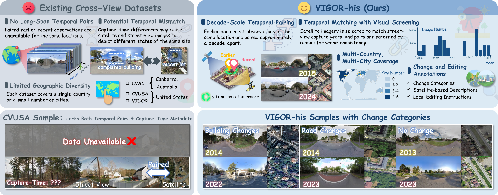

# CrossTimeEdit: A Decade-Spanning Cross-View Dataset and Reward-Guided Editing for Historical Street-View Generation

## Abstract

Historical street-view imagery records urban evolution, but uneven coverage
leaves substantial gaps in historical records. Generating plausible past
appearances requires restoring changed structures while preserving persistent
scene content. We construct VIGOR-his, a decade-spanning cross-view dataset
containing 43,653 location-level quadruplets across 11 cities on three
continents. Its automated pipeline performs spatial pairing, consistency
screening, change classification, and the generation and validation of
satellite-based change descriptions and local editing instructions. Based on
VIGOR-his, we propose CrossTimeEdit, a model that reformulates historical
street-view generation as editing, using recent street views to constrain
viewpoint and unchanged appearance and temporal satellite differences as
change evidence. Starting from FLUX.2 [Klein] 4B, we train CrossTimeEdit through
supervised fine-tuning (SFT) followed by online reinforcement learning (RL). We
design three street-view editing criteria---Instruction Alignment (IA),
Background Preservation (BP), and Quality and Physical Plausibility (QP)---as
both RL reward dimensions and evaluation metrics. We optimize this multi-reward
objective using Within Group Relative Policy Optimization for flow-matching
models (Flow-GRPO) with Group reward-Decoupled Normalization Policy Optimization
(GDPO), which normalizes each reward dimension before aggregation. CrossTimeEdit
improves overall performance across the three editing criteria by 17.12% over
the pretrained baseline, ranks first among evaluated open-source image editing
models, and outperforms cross-view generation models in scene consistency,
visual realism, and perceptual quality.



*VIGOR-his provides paired earlier and recent street and satellite views,
cross-view consistency screening, broad geographic coverage, and structured
change annotations for historical street-view generation.*

This repository contains the implementation of the main CrossTimeEdit
experiment, including dataset-construction prompts, two-stage SFT, online RL
training, inference, and IA/BP/QP evaluation.

## Contents

```text
configs/rl/main.yaml          main Flow-GRPO/GDPO configuration
patches/                      SFT patch for DiffSynth-Studio
prompts/                      construction and evaluation prompts
scripts/                      SFT and RL launch scripts
inference/generate.py         panorama generation
evaluation/editing_vlm.py     IA, BP, and QP evaluation
third_party/flow_factory/     minimal main-experiment RL source
```

## External files

Large artifacts are not stored in Git. Place them at the paths referenced by
`configs/rl/main.yaml`, or update those paths locally:

```text
models/FLUX.2-klein-base-4B/
weights/sft/v3_e9_lora/
data/rl/streetview_change_gt/
```

The CrossTimeEdit LoRA and VIGOR-his metadata are released separately:

```text
https://huggingface.co/CrossTimeEdit/CrossTimeEdit-LoRA
https://huggingface.co/datasets/CrossTimeEdit/VIGOR-his-metadata
```

Google Maps and Street View imagery is not redistributed.

## Installation

Use Python 3.10 or 3.11 on Linux and install a CUDA-compatible PyTorch build.

```bash
bash scripts/setup_sft.sh
source .venv/bin/activate
pip install -e third_party/flow_factory
pip install -r environment/requirements-evaluation.txt
```

## SFT

```bash
export MODEL_BASE=models/FLUX.2-klein-base-4B
export DATA_ROOT=data/images
export SFT_MANIFEST=data/manifests/sft_train.jsonl
export CUDA_VISIBLE_DEVICES=0,1,2,3
bash scripts/train_sft_phase1.sh
bash scripts/train_sft_phase2.sh
```

The scripts reproduce the reported two-stage LoRA training with four processes,
LoRA rank 32, and 512 x 1024 panoramas.

## Online RL

```bash
export GEMINI_API_KEY=your_key
export GEMINI_BASE_URL=https://generativelanguage.googleapis.com
bash scripts/train_rl.sh
```

The main configuration uses Flow-GRPO with GDPO reward normalization and
independent IA, BP, and QP rewards weighted by 0.45, 0.30, and 0.25.

## Inference

Run one process per GPU. For rank 0 in a four-GPU job:

```bash
python inference/generate.py \
  --gpu 0 --rank 0 --world-size 4 \
  --manifest data/manifests/test.json \
  --data-root data/images \
  --base-model models/FLUX.2-klein-base-4B \
  --lora weights/crosstimeedit.safetensors \
  --output-dir outputs/test
```

Use ranks 1-3 for the remaining GPUs.

## Evaluation

```bash
python evaluation/editing_vlm.py \
  --name CrossTimeEdit \
  --manifest data/manifests/test.json \
  --data-root data/images \
  --image-dir outputs/test \
  --output outputs/editing_scores.jsonl
```

Set `GEMINI_API_KEY` before running the evaluator. Credentials must never be
written into source files or committed to Git.

## Citation

```bibtex
@misc{lu2026crosstimeedit,
  title  = {CrossTimeEdit: A Decade-Spanning Cross-View Dataset and Reward-Guided Editing for Historical Street-View Generation},
  author = {Lu, Hanwen and He, Jun and Yang, Mingjia and Wei, Hao and Huang, Jinhao and Lin, Yi and Zhang, Xiang},
  year   = {2026},
  note   = {arXiv preprint}
}
```
